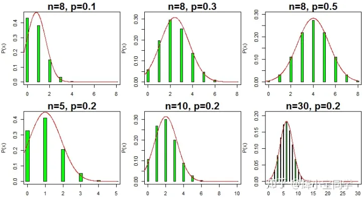

# 超几何分布

来源：https://zhuanlan.zhihu.com/p/49267988

[toc]

## 一、离散概率分布（Discrete probability distribution）

所谓“离散”是指随机变量只能取有限个或者可列举无穷多个值。

- **概率质量函数（probability mass function，简称PMF）：** 是离散随机变量$X$在各特定值上取的概率 $P(x) $，其总和为1. 与 **概率密度函数** $f(x)$ 不同，概率质量函数是对离散随机变量定义的，本身就代表该值的概率；而概率密度函数是对连续随机变量定义的，本身不是概率，它在某区间内的积分才是概率。

- **累积分布函数（cumulative distribution function，简称CDF）:** 定义为 $F(x) = P(X\le x)$ ，是单调递增的，且满足：$F(-\infty) = 0 $ 和 $ F(+\infty) = 1$ 。对离散分布而言，它是所有小于等于 $x$ 的值出现的概率之和。

## 二、伯努利分布

在现实生活中，许多事件的结果往往只有两个。例如：抛硬币，正面朝上的结果只有两个：国徽或面值；检查某个产品的质量，其结果只有两个：合格或不合格；购买彩票，开奖后，这张彩票的结果只有两个：中奖或没中奖；拨打女朋友电话：接通或没接通……以上这些事件都可被称为伯努利试验。

伯努利试验是单次随机试验，只有“成功”（值为1）或“失败”（值为0）两种结果。其概率分布称为伯**努利分布（Bernoulli distribution）**，也称为两点分布或0-1分布。是最简单的离散概率分布。

记成功概率为 $p(0\le p \le 1)$，则失败的概率为 $q = 1-p$

- 其概率质量函数为：$$P(x) = p^x(1-p)^{1-x} = \begin{cases}
p & ,x=1\\
q & ,x= 0
 \end{cases}
 $$

- 其期望值为：$$E(x) = \sum{x}P(x) = 0\times q + 1 \times p = p$$

- 其方差为：$$Var(x)=E[(x-E(x))^2]=\sum(x-p)^2P(x)$$

## 三、二项分布

### 3.1 定义

假设某个试验是伯努利试验，其成功概率用p表示，那么失败的概率为q=1-p。进行n次这样的试验，成功了x次，则失败次数为n-x，发生这种情况的概率可用下面公式来计算：
$$P(x)=C^x_np^x(1-p)^{n-x}=\frac{n!}{x!(n-x)!}p^x(1-p)^{n-x}$$

我们称上面的公式为 **二项分布（Binomial distribution）** 的概率质量函数。其中 $$C^x_n=\frac{n!}{x!(n-x)!}$$ 是**组合公式**，表示从n个不同元素中取出x个元素的所有组合的个数。

从二项分布公式可知，概率分布由试验次数n和"成功"概率p决定，因此二项分布的概率质量函数可以简写为X~B(n, p)。

### 3.2 二项分布性质

**二项分布的均值和方差分别为 $np$ 和 $npq$**。

二项分布的另一个性质是其**分布形状的变化规律**。从二项分布概率质量函数$P(x)$可知，概率分布只与试验次数n和成功概率p有关，其分布形状的变化规律为：

- "成功"概率p越接近0.5(也即"成功"概率与"失败"概率越接近)，二项分布将越对称。**保持二项分布试验的次数n不变，随着成功概率p越接近0.5，二项分布逐渐对称，且近似于均值为np、方差为npq的正态分布。**(见下图的第一排3个子图)

- 对于任意"成功"概率p，**无论其距离0.5有多远，随着试验次数n的增加，二项分布与均值为np、方差为npq的正态分布越来越接近。**(见下图的第二排3个子图)

## 四、几何分布（Geometric distribution）

几何分布只由“成功”概率p决定，记为X~G(p)。

同二项分布一样，几何分布也基于伯努利试验，其自变量的定义有下面两种形式：

- 在伯努利试验中，得到首次成功所需要的试验次数k，k的取值范围为{ 1, 2, 3, … }
- 在得到首次成功之前所经历的失败次数k，k的取值范围为{ 0, 1, 2, 3, … }

具体用哪一种，取决于惯例和使用方便。为了避免歧义，最好明确说明自变量的取值范围。

### 4.2 概率分布、均值、方差

假设伯努利试验的成功概率为p，则失败概率为$q=1-p$。那么首次成功之前经历k次失败的概率为

$$P(X=k) = (1-p)^kp$$，其中 $ k=1,2,3,\dots$

均值：
$$E(x)=\frac{1-p}{p}$$

方差：
$$Var(x)=\frac{1-p}{p^2}$$

## 五、超几何分布（Hypergeometric distribution）

对于二项分布和几何分布，它们均基于伯努利试验，每次试验结果的发生概率是不变的，而超几何分布试验结果的概率会随着每一次试验的发生而改变。以随机抽样为例，二项分布试验和几何分布试验是有放回抽样（总体数量保持不变），因此每次试验结果的发生概率是保持不变的；而超几何分布试验则是在有限总体中进行无放回抽样（总体数量不断减少），所以每次试验结果发生的概率将发生变化。

### 5.1 概率分布

超几何分布是一种重要的离散型概率分布，其概率质量函数可以这样定义：假设有限总体包含N个样本，其中质量合格的为m个，则剩余的N-m个为不合格样本，如果从该有限总体中抽取出n个样本，其中有k个是质量合格的概率为：

$$P(X=k)=\frac{C^k_m\times C^{n-k}_{N-m}}{C^n_N}$$

记为X~H(N,m,n)。

### 5.2 性质

1. k的取值范围为 $\{max(0,n+m-N),\dots,min(n,m)\}$ ，其期望和方差分别为：

期望：
$$E(k)=n\frac m N$$

方差：
$$Var(k)=n\frac{m}{N}\frac{N-m}{N}\frac{N-n}{N-1}$$

2. 如果抽取数目n=1（即从有限总体中只抽取一个样本），那么超几何分布将还原成伯努利分布。

3. 如果样本总体N为无穷大(也即将有限总体换成无限总体)，此时是否放回抽中的样本对于质量合格样本所占比例没有影响，超几何分布也可视为二项分布。在实际应用中，只要样本总体的数目是抽取数目的10倍以上(即N>10n)，就可用二项分布来近似描述超几何分布，通过两种概率质量函数计算得到的概率几乎相同。对于这个性质，我们将在后面用一个例子来说明。
